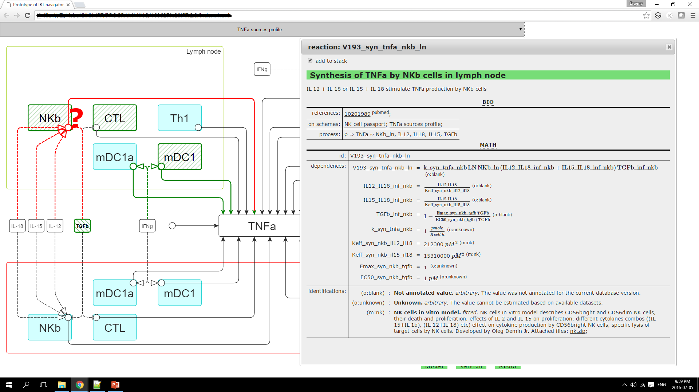
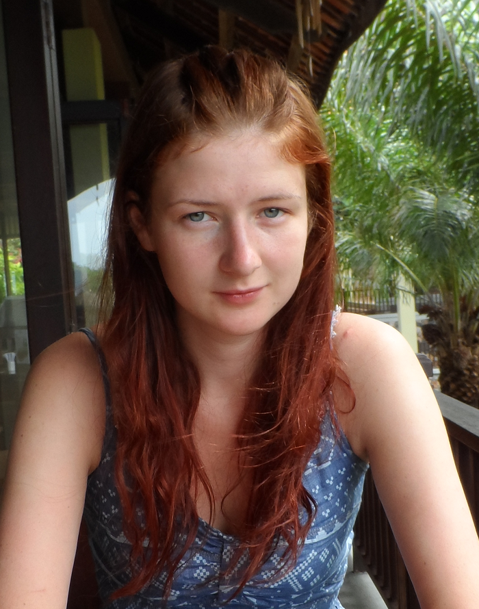
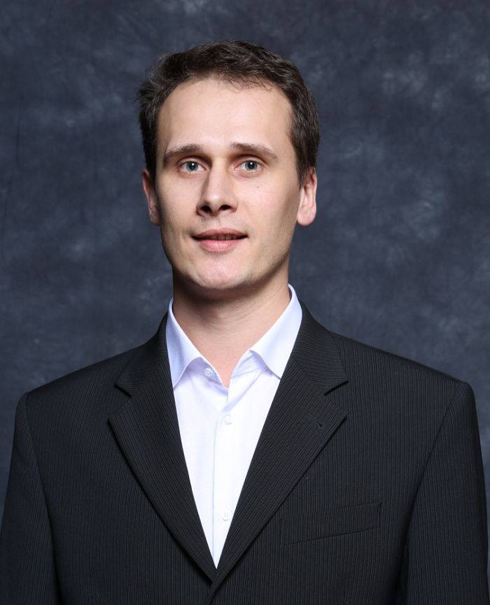

_social networks and subscription_

**If you are interested in obtaining demo or commercial version of IRT package please make a request by email.**

# Immune Response Template

IRT is a initiative project for a full cycle infrastructure for population, validation and visualization of the available data on immune cells and cytokine interactions in humans. The unique feature of the project is its focus on tools and support for QSP modeling by providing:

* interactive schemes (passports of immune cells);
* annotation of each process, cell and cytokine with cross references and links to the external databases;
* rate equations of key processes involved in immune response derived on the basis of existing knowledge;
* values of parameters of the rate equations identified via fitting of the specific sub-models to human in vitro and in vivo data;
* extended annotation of rate equations and parameters;
* automatic generation of model templates.

IRT team makes an effort in two direction: the development of database on human immune cells interaction (IRT database) and the development of tools for navigation and model creation (IRT navigator).

Try: [IRT demo](online)

## Read more

Download: [IRT main features booklet](doc/IRT 1.0 2016 booklet A5 online.pdf)

Download: [IRT summary presentation](doc/160901_IRT_presentation_ISB.pdf)

# News

2016-10-26 Oleg Demin Jr. presented his report "Immune Response Template for Quantitative Systems Pharmacology Modeling of Immunotherapy in Oncology" on ACoP 2016, Bellevue, Washington. Download poster

2016-09-01 12:00 Today is the offical release of IRT 1.0! The demo package has been sended to all subscribers of the project. The full functionality version will be available based on commercial license. Contact IRT team.

2016-07-01 17:51 This site is available on http://irt.insysbio.ru.

2016-06-29 12:30 The release date of IRT was postponed until 2016-09-01 12:00.

# IRT database

## Motivation
Immunotherapy is a new class of cancer treatment that works by activation of immune response of patient to fight with tumor cells. The immunotherapy is able to demonstrate very high efficacy in cancer treatment (for, example, PD-1 and PD-L1 inhibitors) the strong stimulation of immune systems could lead to the side effect related to the autoimmunity. That is why optimization of different types of immunotherapies and their combinations is very important to stimulate immune system strong enough to kill tumor cells, but not so strong to cause autoimmunity. The main challenge in optimization of immunotherapies is the complexity of immune system, interactions between different types of immune cells, cancer cells, cytokines, chemokines and other participant of immune response.

The aim of this project is to develop a tool describing interaction of different types of immune cells, cytokines, chemokines and other participants of immune response.

**immune cell passport**

**cytokines sources profile**

## Content of database

For each type of immune cells we have developed **"cells passport"** which is the scheme visualizing literature available experimental facts on

- activation/differentiation and proliferation of the cell;
- cytokines which is synthesized by this type of cell upon activation;
- cytokines/cells that affect this type of cell.

For each cytokine we have developed a scheme (*cytokines sources profile*) visualizing literature available experimental facts on

- production of the cytokine by different immune cells located in blood, lymph node and tissue;
- regulation of production of the cytokine by other cytokines.

# IRT navigator

## Purpose
IRT navigator is a tool to access IRT database. IRT navigator provides the intuitive interface for searching the information and model template creation. IRT navigator allows:

- visualization of cell dynamics of immune cells;
- navigation across multiple interactions of immune cells;
- automatic generation of model template based on the user selection which can be downloaded as SBML file;
- automatic summary report generation based on the user selection.

**IRT navigator prototype.png**

# Team
**Oleg Demin Jr.: idea, modeling, coordination**
 

**Antonina Nikitich: analytics, modeling, literature search**
 

**Evgeny @metelkin: database schema, scripting, "design"**
 

Other ISBM folks: **Oleg Demin, Alexander Stepanov**
PR, schemes, testing

---

by Institute for Systems Biology Moscow