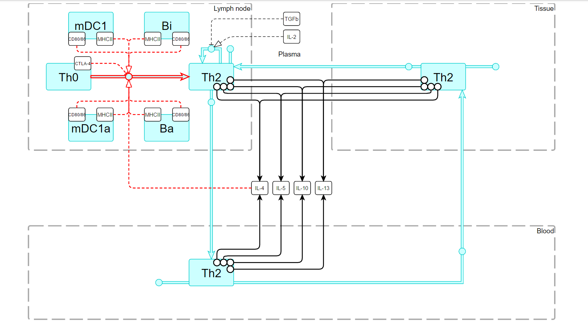

## Immune Response Template

IRT is a project aimed to collect, analyze and visualize available data on immune cells, cytokine, chemokines and other mediators interactions in humans. The unique feature of the project is its focus on quantitative systems pharmacology (QSP) modeling. The goal of the project is a tool for investigation of immune system and its multiple interactions, and for development of QSP models/platforms related to immune in human.

IRT team makes efforts in two directions: the development of database on human immune cells interaction (**IRT database**) and the development of tools for navigation and model creation (**IRT navigator**).

## IRT database

Current release **IRT database 1.0** describes about 10 types of cells, 10 surface molecules, 20 cytokines and 300 processes in 3 compartments: blood/plasma, lymph nodes and unspecified tissue.

IRT database includes:

* interactive schemes (**passport of immune cell** and **cytokine source profile**) for database navigation;
* annotation of each process, cell and cytokine with cross references and links to the external databases;
* rate equations of key processes involved in immune response derived on the basis of existing knowledge; 
* values of parameters of the rate equations identified via fitting of the specific "in vitro" models against _in vitro_ data or calculated using _in vivo_ data measured for **healthy human**;
* extended annotation of rate equations and parameters.

**immune cell passport**

**cytokines sources profile**

The database is distributed under two revisions:

<table style="width:100%;text-align: center;font-weight: bold;border-width:0px;">
<tr>
<td style="border-width:0px;width:50%;"></td>
<td style="border-width:0px;width:50%;">
  <a href="mailto:IRT%20team<irt@insysbio.ru>?subject=Request%20for%20Immune%20Response%20Template&body=I'd%20like%20to%20request%20for%20Immune%20Response%20Template full version">
    
  </a>
</td>
</tr>
<tr>
<td style="border-width:0px;width:50%;">The demo version and code is available online for free under <a href="https://creativecommons.org/licenses/by-nd/4.0/legalcode">CC BY-ND 4.0</a> lisence.</td>
<td style="border-width:0px;width:50%;">The full version can be obtained under commercial license after request to <b>irt@insysbio.ru</b></td>
</tr>
</table>

## IRT navigator

**IRT navigator** provides the intuitive interface for searching the information and model template creation.  IRT navigator functionality:

* visualization of description and annotation of IRT database components: equations, species, parameters;
* access to supplementary materials including files related to in vitro models (used for parameters fitting against _in vitro_ data), files with description of parameters calculation and estimation of initial values for species;
* navigation across multiple interactions of immune cells;
* automatic generation of model template based on the user selection which can be downloaded as SBML L2/L3 file with or without full or partial annotation;
* "filter" search across whole database including interactive representation of search results on the schemes;
* various capabilities to include/exclude and check elements in the model of your choice;
* the ability to upload and continue to work with your previously downloaded model template;
* generation of summary with ODE system for chosen elements;
* running of IRT in one click in different OS (Windows, Mac OS, Linux).

**IRT navigator**

## Let people know about us

<ul class="share-buttons">
  <li>
    
  </li>
  <li>
    
  </li>
  <li>
    
  </li>
  <li>
    
  </li>
  <li>
    
  </li>
</ul>

## Be in touch

## Learn more

* [IRT main features booklet](doc/IRT 1.0 2016 booklet A5 online.pdf)

* [IRT summary presentation](doc/160901_IRT_presentation_ISB.pdf)

* tutotials: _coming soon_

## Team

- [Oleg Demin Jr.](https://www.linkedin.com/in/demin-jr "LinkedIn profile"): idea, modeling, coordination

- **Antonina Nikitich:** analytics, modeling, literature search

- @metelkin: database schema, scripting, "design"

- Other [ISBM](http://insysbio.ru/en "ISBM home page") folks: **Oleg Demin**, **Alexander Stepanov**, **Maria Maximova**

<a class="fb-xfbml-parse-ignore" target="_blank" href="https://www.facebook.com/sharer/sharer.php?u=http%3A%2F%2Firt.insysbio.ru%2F&amp;src=sdkpreparse">Share</a>
